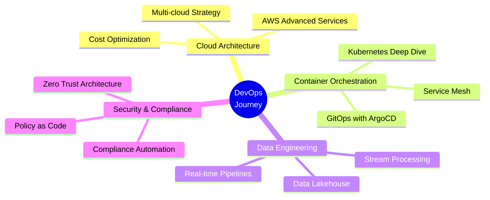

<div align="center">


<a href="https://git.io/typing-svg" target="_blank"></a>

<p align="center">
  <a href="https://sahilbansal.vercel.app" target="_blank">
    
  </a>
  <a href="https://www.linkedin.com/in/sahilbansal24/" target="_blank">
    
  </a>
  <a href="mailto:sahilbansal.sb24@gmail.com">
    
  </a>
  <a href="https://twitter.com/sahilbansalll" target="_blank">
    
  </a>
</p>


</div>

---

## 🚀 About Me

<table>
<tr>
<td width="60%">

```yaml
name: Sahil Bansal
role: DevOps Engineer
company: Buyogo AG
location: India 🇮🇳
education: B.Tech in Computer Science (UPES)

current_focus:
  - Multi-tenant cloud infrastructure
  - Real-time data pipelines
  - Cost optimization strategies
  - Infrastructure automation

interests:
  - Kubernetes & Container Orchestration
  - Data Engineering & Analytics
  - Cloud Cost Optimization
  - DevSecOps & Security

achievements:
  - Reduced AWS costs by $40k annually
  - Architected 99.99% uptime infrastructure
  - 40% faster incident recovery with IaC
  - Prevented 95% of critical CVEs
```

</td>
<td width="40%">


</td>
</tr>
</table>

---

## 💼 Professional Journey


### **Software Engineer — DevOps & Cloud Infrastructure**

**Buyogo AG** | *Jun 2024 - Present*

✨ Architected **99.99% available** multi-tenant FTP platform using SFTP-gateway  
⚡ Led **ClickOps to Terraform** transformation, reducing TTR by **40%**  
💰 Reduced AWS spend by **40% (~$40k annually)** using Fargate Spot & Savings Plans  
📊 Built **real-time data lakehouse** with Dagster, DLT, and ClickHouse  
🔍 Implemented **service-level observability** with Prometheus and Grafana  
🔐 Executed zero-downtime **Auth0 tenant migration** for 1,000+ users

<br clear="left"/>


### **Analyst Trainee — Cloud & DevOps**

**Capgemini** | *Jan 2024 - Jun 2024*

🔄 Refactored monolithic CI/CD pipelines, increasing success rates by **15%**  
🚨 Integrated Prometheus alerting with Slack, reducing incident response by **20%**

<br clear="left"/>


### **Software Engineer — DevSecOps**

**Qapita Fintech** | *Jun 2023 - Nov 2023*

🛡️ Embedded security gates in AWS CodeBuild, preventing **95% of critical CVEs**  
📈 Migrated logging storage to AWS EFS, improving query performance by **30%**

<br clear="left"/>


### **Software Engineer Intern**

**Xebia** | *Jun 2022 - Jul 2022*

🚀 Automated CI/CD workflows in Azure DevOps and improved front-end performance using ReactJS

<br clear="left"/>

---

## 🛠️ Tech Arsenal

<div align="center">

### ☁️ Cloud & Infrastructure

<p>
  
</p>
<p><code>AWS</code> <code>Terraform</code> <code>Docker</code> <code>Kubernetes</code> <code>Linux</code> <code>Nginx</code> <code>Redis</code></p>

### 🔄 CI/CD & Automation

<p>
  
</p>
<p><code>GitHub Actions</code> <code>Jenkins</code></p>

### 📊 Observability & Monitoring

<p>
  
</p>
<p><code>Prometheus</code> <code>Grafana</code></p>

### 💾 Databases & Data Engineering

<p>
  
</p>
<p><code>PostgreSQL</code> <code>MongoDB</code> <code>MySQL</code> <code>Redis</code></p>

### 💻 Programming & Scripting

<p>
  
  
  
</p>
<p><code>Python</code> <code>Bash</code> <code>HCL</code> <code>YAML</code></p>

### 🔧 Tools & Platforms

<p>
  
</p>
<p><code>Git</code> <code>GitHub</code> <code>VS Code</code> <code>Postman</code> <code>Figma</code></p>

</div>

---

## 📊 GitHub Analytics

<div align="center">
  
  
</div>

<div align="center">
  
  
</div>

---

## 🏆 Achievements & Impact

<div align="center">

| 🎯 Metric | 📈 Achievement | 💡 Impact |
|-----------|----------------|-----------|
| **Uptime** | 99.99% | Multi-tenant FTP platform |
| **Cost Savings** | $40k/year | AWS optimization & right-sizing |
| **Recovery Time** | 40% faster | Infrastructure as Code with Terraform |
| **Security** | 95% CVE prevention | DevSecOps gates in CI/CD |
| **Performance** | Minutes → Milliseconds | Real-time data lakehouse |
| **Velocity** | 30% increase | Parallelized CI/CD pipelines |

</div>

---

<div align="center">
  
## 🎓 Education

**B.Tech in Computer Science Engineering**  
🏛️ University of Petroleum and Energy Studies (UPES)  
📅 2019 - 2023

</div>

---

## 📈 Contribution Activity

<div align="center">
  
<a href="https://github.com/ashutosh00710/github-readme-activity-graph" target="_blank"></a>

</div>

---

## 🐍 Watch My Contributions Get Eaten

<div align="center">
  


</div>

---

## 🎯 Current Focus

<div align="center">



</div>

---

## 📊 Weekly Development Breakdown

<!--START_SECTION:waka-->
<!--END_SECTION:waka-->

---

<div align="center">

## 💬 Let's Connect & Collaborate

I'm always excited to discuss **DevOps**, **Cloud Architecture**, **Automation**, and **Open Source**!

<p>
  <a href="https://sahilbansal.vercel.app" target="_blank">
    
  </a>
  <a href="https://www.linkedin.com/in/sahilbansal24/" target="_blank">
    
  </a>
  <a href="mailto:sahilbansal.sb24@gmail.com">
    
  </a>
</p>

### 💡 *"Automate everything, optimize relentlessly, and build for scale"*


</div>
