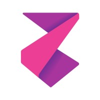
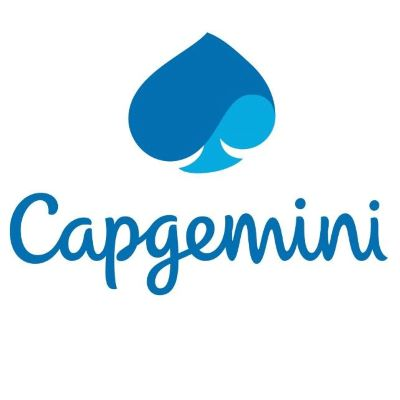
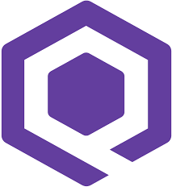

# Sahil Bansal

**DevOps Engineer** · Building cloud infrastructure that doesn't break at 3am.

---

- 🔭 Currently working on **multi-tenant cloud infrastructure** at [Buyogo AG](https://www.buyogo.com)
- 🌱 Learning **Platform Engineering, ArgoCD, Data Lakehouse patterns**
- 💬 Ask me about **AWS cost optimization, Terraform, CI/CD pipelines**
- 📄 [Resume](https://resume.sahilbansal.net/)

---

## 💼 Experience

 **Software Engineer — DevOps & Cloud** · [Buyogo AG](https://www.buyogo.com) · *Jun 2024 – June 2026*
- Architected 99.99% available multi-tenant SFTP platform serving 500+ merchants
- Reduced AWS spend by ~$40k/year through Fargate Spot, Savings Plans & VPC endpoint optimization

 **Workflow Automation Engineer** · [ZabeSync](https://sync.zabe.in/) · *Mar 2026 – Apr 2026*
- Built end-to-end LinkedIn content automation pipeline (n8n + AWS EC2 + Discord control plane)
- Automated ideation → drafting → publishing with Supabase-backed deduplication

 **Analyst Trainee — Cloud & DevOps** · [Capgemini](https://www.capgemini.com) · *Jan 2024 – Jun 2024*
- Refactored monolithic CI/CD pipelines — 15% higher success rate
- Integrated Prometheus alerting with Slack — 20% faster incident response

 **Software Engineer — DevSecOps** · [Qapita Fintech](https://www.qapita.com) · *Jun 2023 – Nov 2023*
- Embedded security gates in AWS CodeBuild — prevented 95% of critical CVEs

---

## 🛠️ Tech Stack

  

📋 Full breakdown

| Category | Technologies |
|---|---|
| **Cloud & Infra** | AWS (ECS, Lambda, RDS, S3, IAM, VPC), Docker, Kubernetes, Nginx |
| **IaC** | Terraform, CloudFormation, HCL |
| **CI/CD** | GitHub Actions, Jenkins, AWS CodeBuild |
| **Observability** | Prometheus, Grafana, CloudWatch, Alertmanager |
| **Data** | Dagster, DLT, DBT, ClickHouse, Sling |
| **Databases** | PostgreSQL, MySQL, MongoDB, Redis |
| **Automation** | n8n, Supabase, Discord Bots, LinkedIn API |
| **Security** | Auth0, AWS SSO, IAM, DevSecOps |

---

## 📌 Featured Projects

| Project | What it does | Stack |
|---|---|---|
| [**LumaCV**](https://luma-cv.vercel.app/) | AI resume builder — 30 min → <60 sec tailoring with multi-LLM failover | Next.js, Supabase, LaTeX |
| [**Claude Superpack**](https://github.com/sahilbnsll/claude-superpack) | 33-skill agentic system for Claude Code with persistent memory | Node.js, Bash, Markdown |
| **LinkedIn Automation** | End-to-end content pipeline triggered from Discord | n8n, AWS EC2, Supabase |
| **Naukri Bot** | Headless resume uploader running 24/7 on Render free tier | Python, Selenium, Docker |

🏗️ Infrastructure projects (at Buyogo AG)

- **Multi-Tenant SFTP Platform** — 99.99% uptime, 500+ merchants, chroot-isolated
- **Real-Time Data Pipeline** — Dagster + DLT + ClickHouse (minutes → sub-100ms queries)
- **IaC Migration** — ClickOps → Terraform, 40% faster MTTR
- **Observability Platform** — Prometheus + Grafana, 60% lower MTTD
- **Auth0 Migration** — Zero-downtime cutover for 1,000+ users

---

## 📊 GitHub Stats

  
  

---

## 📈 Contribution Graph

<picture>
  
</picture>

---

## 🧊 3D Contribution Map

<picture>
  
</picture>

---

## 🐍 Watch the Snake Eat My Contributions

<picture>
  <source media="(prefers-color-scheme: dark)" srcset="https://raw.githubusercontent.com/sahilbnsll/sahilbnsll/output/github-contribution-grid-snake-dark.svg">
  <source media="(prefers-color-scheme: light)" srcset="https://raw.githubusercontent.com/sahilbnsll/sahilbnsll/output/github-contribution-grid-snake.svg">
  
</picture>

---

## 📅 Isometric Contribution Calendar

<picture>
  
</picture>

---

## 💭 Random Dev Quote

---

*"Automate everything, optimize relentlessly, and build for scale."*

